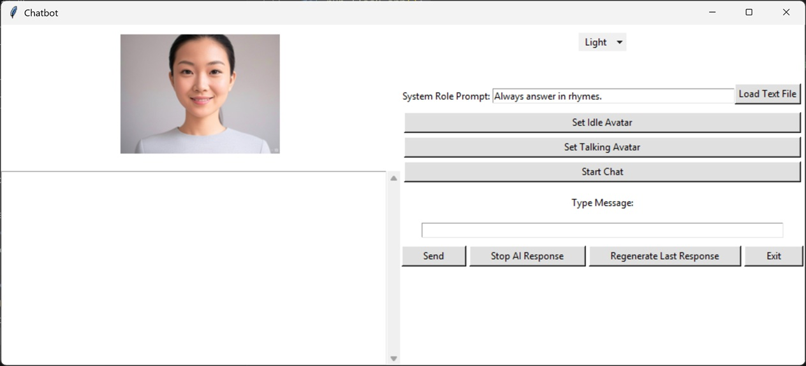

## Overview
This is a Light AI chatbot interface designed to handle various text-to-speech (TTS) functionalities and image generation based on user interactions. It uses the Piper TTS engine and Whisper.cpp. The LLM can be hosted using LM Studio or Ollama

## Features
- **Fast response time:** Real-Time full speech without having to hit record or play
- **Avatar in image or video format**

## Requirements
- Python 3.x
- LM Studio or Ollama hosting the LLM
- Whisper-cli.exe in project folder - https://github.com/ggerganov/whisper.cpp/releases/tag/v1.7.4
- Piper.exe in project folder - https://github.com/rhasspy/piper/releases/tag/2023.11.14-2
- Other dependencies listed in `requirements.txt`

## Installation

1. Clone the repository:
   ```bash
   git clone https://github.com/drank10/AnotherLiteChatbot.git
   cd AnotherLiteChatbot
   ```

2. Install dependencies:
   ```bash
   pip install -r requirements.txt
   ```

3. Run the program:
   ```bash
   python main.py
   ```

## Usage

1. **Set a system prompt:** Manually enter system prompt for character profile or select from file 
2. **Start Chatting:** Press the Start button to start chatting or enter a text message
3. **Stop Chatting** Say Exit to quit program
   
## Customization
- You can modify the TTS voice models, system prompts, and other settings through the interface or by editing the source code.
- Different models of STT (Whisper Tiny), LLM can be used to adjust performance and used VRAM.

## Contributing
Feel free to fork this repository and submit pull requests! If you encounter any issues, please create an issue on GitHub.

## License

This project is licensed under the MIT License. See the [LICENSE](LICENSE) file for more details.
```
